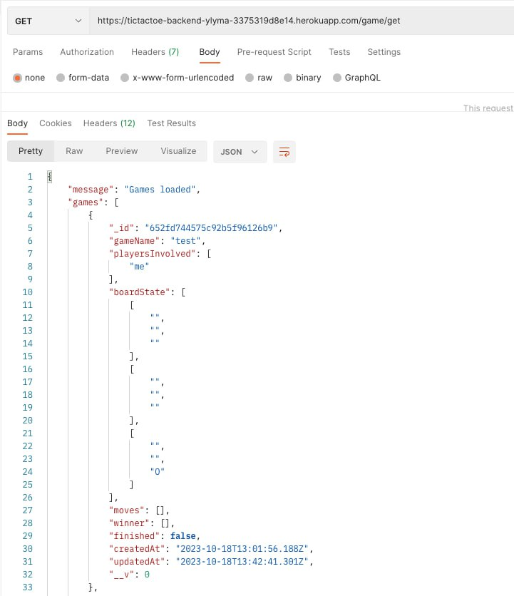
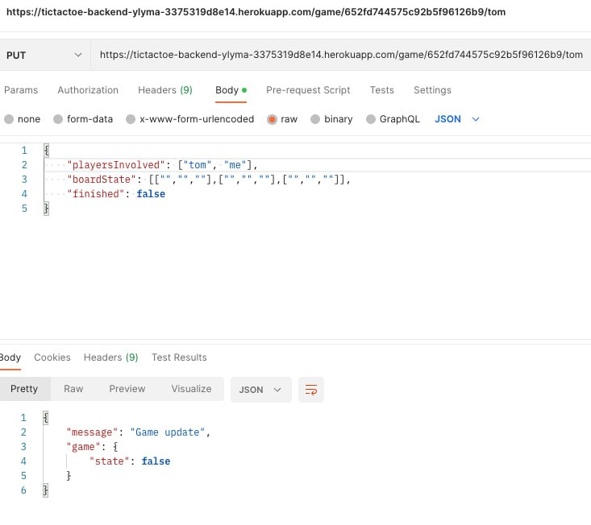

# accessible-tictactoe

This is an accessible tictactoe web application, designed to be as inclusive as possible.

## Setup

1. Clone git repo with `git clone`.

### Local

#### Installation

1. You need to have (MongoDB)[https://www.mongodb.com/docs/manual/installation/] installed.

#### Usage

1. `cd` into frontend subfolder with `cd frontend`.

2. Change the name of the `.env.sample` file into `.env`. Replace INSERT_URL_HERE as follows:

```
DB_LOCAL_URI=http://localhost:27017
```

3. Run `npm start`. This will open a `http://localhost:3000` window on your browser.

4. `cd` into backend subfoler with `cd backend`.

5. Change the name of the `.env.sample` file into `.env`. Replace INSERT_URL_HERE as follows:

```
DB_LOCAL_URI=http://localhost:3000
```

5. Run `npm run start`. This starts the local database.

### Production

#### Usage

Alternatively, you can access the deployed website [here](https://accessible-tictactoe-frontend-ptn5miogt-ylymas-projects.vercel.app/).

## Notes

### Decisions Made

The website was designed with accessibility in mind. Hence, I made sure colours had high colour contrast of at least 6. With the browser screen reader in Microsoft Edge, I made sure all headings could be read aloud. The components were also made to be as large as possible.

### Future plans

Due to the tight time restraints on this project, I was not able to fully implement all the design ideas I had. Some features I hope to include to aid accessibility are:

1. The ability to navigate through the app with just the keyboard.

2. Voice inputs.

## API

### HTTP

1. Post

```
https://tictactoe-backend-ylyma-3375319d8e14.herokuapp.com/game/post
```


2. Get

```
https://tictactoe-backend-ylyma-3375319d8e14.herokuapp.com/game/get
```



3. Put

```
https://tictactoe-backend-ylyma-3375319d8e14.herokuapp.com/game/put
```



### Websockets
