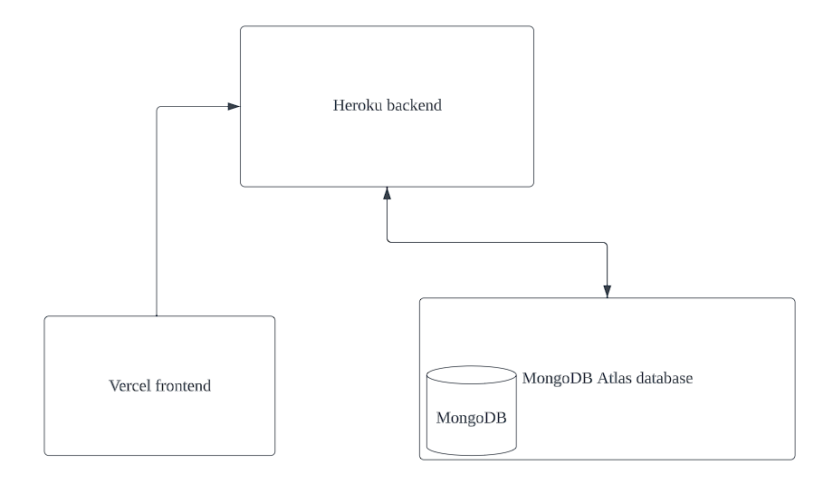
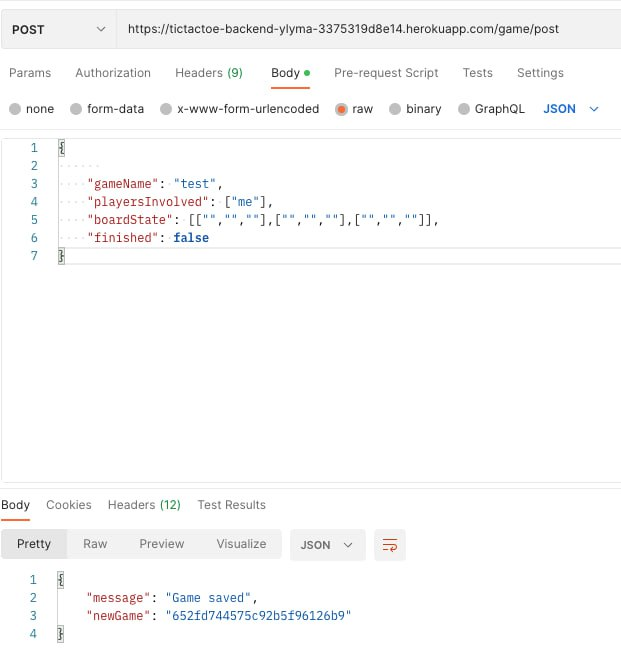
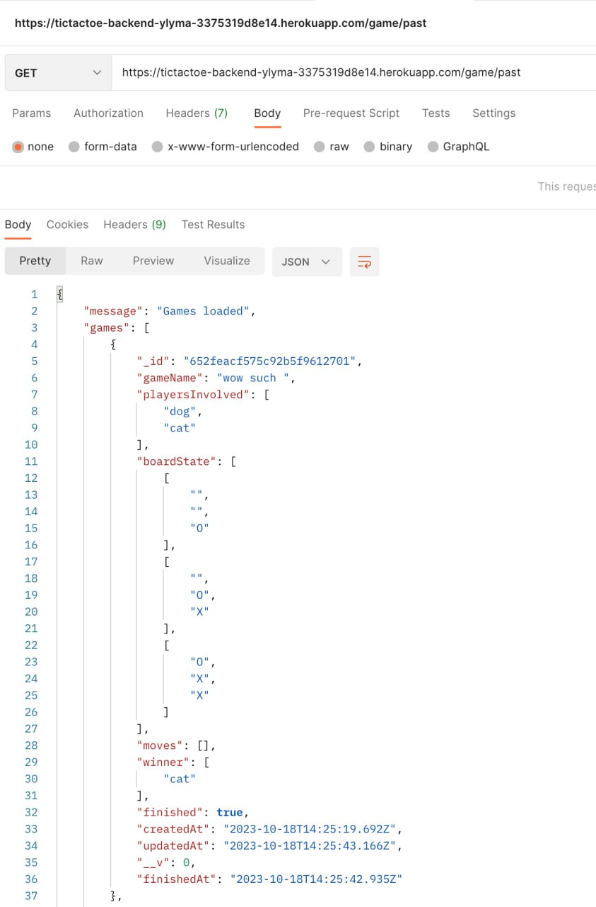

# accessible-tictactoe

This is an accessible tictactoe web application, designed to be as inclusive as possible.

## Setup

1. Clone git repo with `git clone`.

### Local

#### Installation

1. You need to have (MongoDB)[https://www.mongodb.com/docs/manual/installation/] installed.

#### Usage

**To deploy frontend:**

1. `cd` into frontend subfolder with `cd frontend`.

2. Change the name of the `.env.sample` file into `.env`. Replace INSERT_URL_HERE as follows:

```
DB_LOCAL_URI="mongodb://0.0.0.0:27017"
```

3. Run `npm start`. This will open a `http://localhost:3000` window on your browser.

**To deploy backend:**

1. `cd` into backend subfoler with `cd backend`.

2. Change the name of the `.env.sample` file into `.env`. Replace INSERT_URL_HERE as follows:

```
REACT_APP_API_URL="http://localhost:3001"
```

3. Run `npm run start`. This starts the local database.

### Production

#### Usage

Alternatively, you can access the deployed website [here](https://accessible-tictactoe-frontend-ptn5miogt-ylymas-projects.vercel.app/).

## Notes

### Decisions Made

The website was designed with accessibility in mind. Hence, I made sure colours had high colour contrast of at least 6. With the browser screen reader in Microsoft Edge, I made sure all headings could be read aloud. The components were also made to be as large as possible. Every page contains only the most necessary elements, to ensure that the user understands what to do on each page intuitively. User interactions, such as button presses, are also made to have obvious animations. This helps in making the process of using the website intuitive and accessible.

For the website infrastructure, I chose to use MongoDB as a NoSQL database to store all games created, with a field that also stores all moves made in the game. This allows for all past moves to be retrieved. I was unable to make a proper UI to display all past moves in time. However, the implementation should be quite simple and can be done with a get request to get all past games, followed by some parsing to retrieve the field with all past moves in the game. To allow two players to play simultaneously, I made use of websockets for communication. My backend uses NestJS, which supports Typescript natively, allowing for more error-free code.

For deployment, I hosted the backend server on Heroku, the database on MongoDB Atlas, and frontend on Vercel.

### Assumptions

Some assumptions that I had to make were that the user knows how to play tic-tac-toe, as no instructions were provided. I also assumed that they knew English, as no means of translation was provided. Furthermore, I also assumed that they were able to type and use their mouse to navigate the pages.

### Future plans

Due to the tight time restraints on this project, I was not able to fully implement all the design ideas I had. Some features I hope to include to aid accessibility are:

1. The ability to navigate through the app with just the keyboard.

2. Voice inputs.

3. Optimise size of elements for window resizing and zooming in. Although I have implemented this to some extent, the user experience can be made smoother.

4. The ability to translate contents of webpage.

## Architecture Diagram

## API



### HTTP

1. Post new game

```
https://tictactoe-backend-ylyma-3375319d8e14.herokuapp.com/game/post
```



2. Get all games

```
https://tictactoe-backend-ylyma-3375319d8e14.herokuapp.com/game/get
```


3. Get past games

```
https://tictactoe-backend-ylyma-3375319d8e14.herokuapp.com/game/past
```



4. Update game

```
https://tictactoe-backend-ylyma-3375319d8e14.herokuapp.com/game/put
```


## Video


[video link](https://youtu.be/B4Jp7El5InQ)
